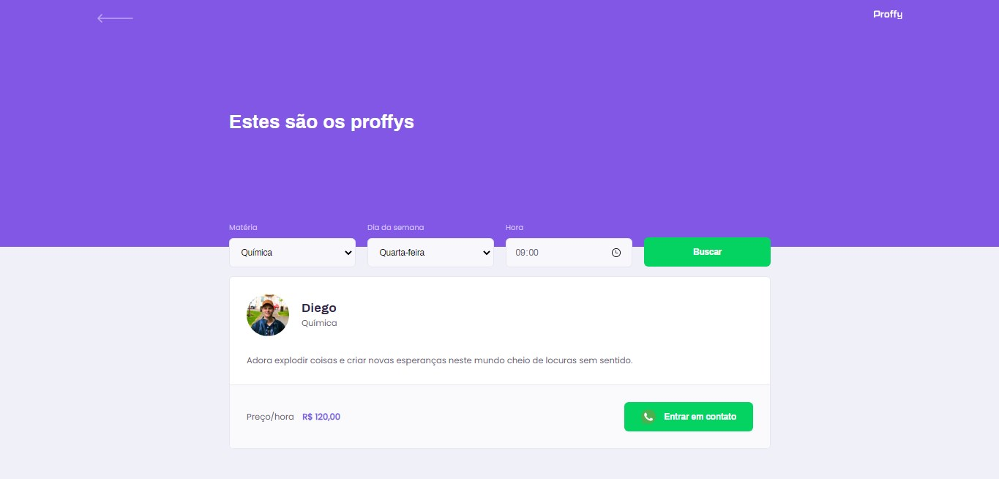
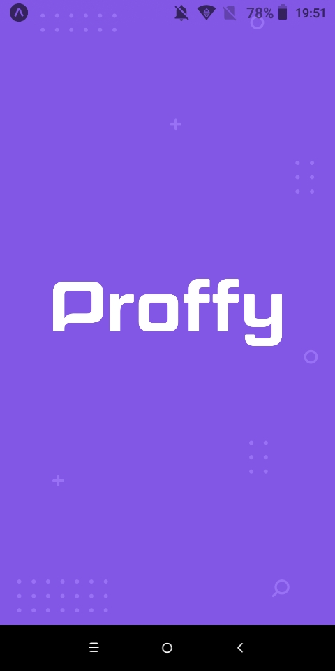

  
  
Plataforma de estudos online

  

    <a href="#keyboard-resultado">Resultado</a>&nbsp;&nbsp;&nbsp;|&nbsp;&nbsp;&nbsp;
    <a href="#page_with_curl-sobre">Sobre</a>&nbsp;&nbsp;&nbsp;|&nbsp;&nbsp;&nbsp;
    <a href="#computer-tecnologias">Tecnologias</a>&nbsp;&nbsp;&nbsp;|&nbsp;&nbsp;&nbsp;
    <a href="#gear-requisitos">Requisitos</a>&nbsp;&nbsp;&nbsp;|&nbsp;&nbsp;&nbsp;
    <a href="#arrow_forward-como-cutilizar">Como utilizar</a>&nbsp;&nbsp;&nbsp;|&nbsp;&nbsp;&nbsp;
    <a href="#recycle-como-contribuir">Como contribuir</a>&nbsp;&nbsp;&nbsp;|&nbsp;&nbsp;&nbsp;
    <a href="#wrench-creditos">Creditos</a>&nbsp;&nbsp;&nbsp;|&nbsp;&nbsp;&nbsp;
    <a href="#customs-license">Licença</a>
  

  

## :keyboard: Resultado

**Captura de tela da interface web**

Veja o deploy do site [clicando aqui](https://proffy-web-deploy.vercel.app).

   
  

**Captura de tela da interface mobile**

Faça o download do **app para android** [clicando aqui](http://www.mediafire.com/file/zp0mxtvjc1fo591/file).

  
  
  
  

## :page_with_curl: Sobre

O projeto Proffy foi desenvolvido na semana Next Level Week (NLW) da [Rocketseat](https://www.youtube.com/rocketseat), a semana foi ministrada pelo **Mestre Jedi** [Diego Fernandes](https://github.com/diego3g).

O objetivo do projeto é conectar professores e seus alunos para agendarem suas aulas online.

## :computer: Tecnologias

### Server (back-end)

- [TypeScript](https://www.typescriptlang.org/)
- [Node.js](https://nodejs.org/en/)

**Dependências**

- [cors](https://www.npmjs.com/package/cors)
- [express](https://expressjs.com/)
- [knex](http://knexjs.org/)
- [sqlite3](https://www.sqlite.org/index.html)

**Dependências de desenvolvimento**

- [ts-node-dev]()
- [typescript](https://github.com/microsoft/typescript)

### Client (front-end)

- [React.js](https://pt-br.reactjs.org/)
- [Hooks](https://pt-br.reactjs.org/docs/hooks-intro.html)
- [JSX](https://pt-br.reactjs.org/docs/introducing-jsx.html)
- [CSS](https://developer.mozilla.org/pt-BR/docs/Web/CSS)
- [TypeScript](https://www.typescriptlang.org/)

**Dependências**

- [axios](https://github.com/axios/axios)
- [react](https://github.com/facebook/react)
- [react-dom]()
- [react-router-dom](https://reacttraining.com/react-router/web/guides/quick-start)
- [react-scripts]()
- [typescript](https://github.com/microsoft/typescript)

#### Mobile

- [React Native com Expo](https://expo.io)
- [Hooks](https://pt-br.reactjs.org/docs/hooks-intro.html)
- [JSX](https://pt-br.reactjs.org/docs/introducing-jsx.html)
- [CSS](https://developer.mozilla.org/pt-BR/docs/Web/CSS)
- [TypeScript](https://www.typescriptlang.org/)

**Dependências**

- [@expo-google-fonts/archivo]()
- [@expo-google-fonts/poppins]()
- [react-native-community/async-storage]()
- [react-native-community/masked-view]()
- [react-navigation/bottom-tabs]()
- [react-navigation/native]()
- [react-navigation/stack]()
- [axios](https://github.com/axios/axios)
- [expo](https://github.com/expo/expo)
- [expo-font](https://github.com/expo/expo/tree/master/packages/expo-font)
- [expo-status-bar]()
- [intl]()
- [react]()
- [react-dom]()
- [react-native]()
- [react-native-gesture-handler]()
- [react-native-reanimated]()
- [react-native-safe-area-context]()
- [react-native-screens]()
- [react-native-swiper]()
- [react-native-web]()

**Dependências de desenvolvimento**

- [@babel/core]()
- [@types/react]()
- [@types/react-native]()
- [typescript](https://github.com/microsoft/typescript)

## :gear: Requisitos

- [Git](https://git-scm.com/)
- [Node.js](https://node.js.org/)
- [Yarn](https://yarnpkg.com/)

## :arrow_forward: Como utilizar

- Primeiro passo, clone o projeto em sua maquina: `git clone https://github.com/zevdvlpr/proffy`

**Servidor**

- Navegue até a pasta do servidor.
- Instale as dependências com o comando: `yarn install`
- Inicie o **servidor** de desenvolvimento com o comando: `yarn start`

**Client**

- Navegue até a pasta da web.
- Instale as dependências com o comando: `yarn install`
- Inicie com o comando: `yarn start`

**Mobile**

- Navegue até a pasta do mobile.
- Instale as dependências com o comando: `yarn install`
- Inicie com o comando: `yarn start`

## :recycle: Como Contribuir

- Faça um Fork deste repositório.
- Crie uma branch com a sua feature: `git checkout -b my-feature`
- Commit suas mudanças: `git commit -m 'feat: My new feature'`
- Push a sua branch: `git push origin my-feature`

## :wrench: Creditos
- [Rocketseat](https://www.youtube.com/rocketseat)
- [Diego Fernandes](https://github.com/diego3g)

## :customs: License

Esse projeto está sob a licença MIT. Veja o arquivo [LICENSE](https://github.com/zevdvlpr/proffy/tree/master/LICENSE) para mais detalhes.
